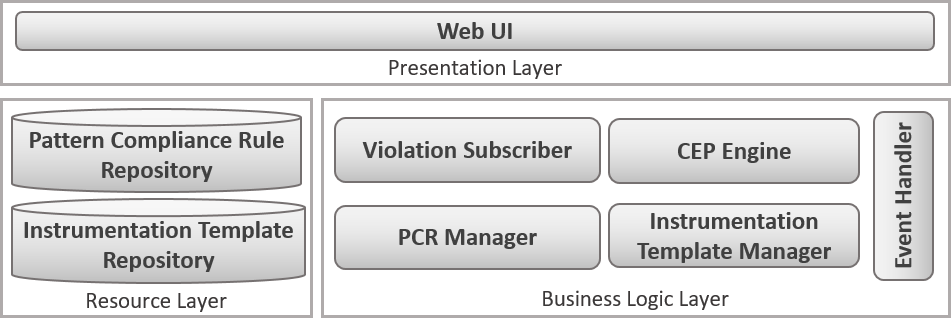
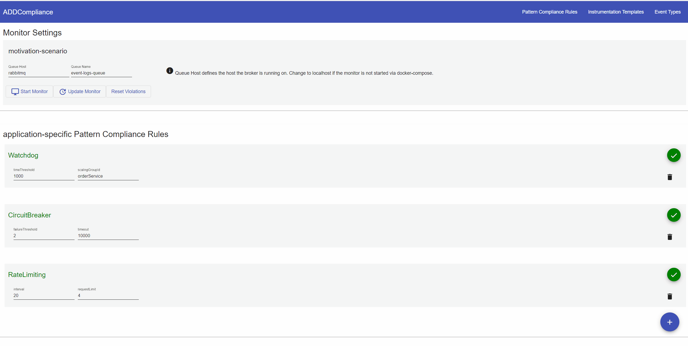

# ADDCompliance

This repo contains the prototype implemented within in the scope of the research paper "Monitoring Behavioral Compliance with Architectural Patterns based on Complex Event Processing".

## Overview

**Please use Chrome for accessing the protoype. For some reason other browsers throw a regexgroup exception due to some problems in the Angular application.** 

### Pattern Compliance Monitor (Monitoring Framework)
The Pattern Compliance Monitor is based on the Spring Framework and the Esper complex event processing runtime. 
An overview of the main components is shown below: 

A *Web UI*, implemented using Angular, provides access to the functionality of the Pattern Compliance Monitor.
The business logic layer comprises the five major components *CEP Engine*, *Violation Subscriber*, *Event Handler*, *PCR Manager*, and *Instrumentation Template Manager*. The CEP Engine implements a complex event processing engine based on the Esper CEP engine.
The PCR Manager is responsible for retrieving application-agnostic Pattern Compliance Rules stored in the Pattern Compliance Rule repository, binding them to application-specific details, and configuring the CEP Engine using the resulting application-specific Pattern Compliance Rules. The collection of application events was implemented based on the RabbitMQ message broker.
Applications can connect to broker and publish messages on a queue. The Event Handler consumes the messages and adds them to the event stream observed by the CEP Engine. The Violation Subscriber subscribes to the Pattern Compliance Rules used as configuration for the CEP engine and receives updates about compliance violations detected by the engine. The Instrumentation Template Manager is used to manage Instrumentation Templates stored in the Instrumentation Template Repository and to retrieve a set of Instrumentation Templates based on the chosen Pattern Compliance Rules and technology-specific details of the application to be monitored.

For the test setup we created *Pattern Compliance Rules* for the three patterns **Rate Limiting**, **Watchdog**, and **Circuit Breaker**.

### Motivating Scenario (Example Application)

In order to simulate a running application to-be monitored, we prototypically implemented a microservice application using Java and packaged each application component as a docker container image. We used Java's aspect-oriented extension AspectJ for realizing unified logging of run-time events without modifying the application code itself. We created aspects for logging the run-time events described by the Pattern Compliance Rules, which were then woven into the application code. Advices in the aspects implemented the logging functionality and pointcuts associated with the advices defined the execution points at which the they should run. We used Logback as a logging framework and added a configuration for pushing all logs necessary for monitoring to the RabbitMQ message broker.

## Getting Started

**Please use Chrome for accessing the protoype. For some reason other browsers throw a regexgroup exception due to some problems in the Angular application.** 

### Run via Docker Swarm
The fastest way to get the monitoring framework and the motivating-scenario up and running is via the docker compose file located in the root folder. Just execute: 

`docker stack deploy -c docker-compose.yaml motivation-scenario`

The ports are mapped as follows:

- monitoring framework: localhost:8080
- rabbitMq: localhost:  localhost:15672 (user: guest, pw: guest)
- orderService:    localhost:5000
- shippingService:     localhost:5050

Scaling an service in the swarm

`docker service scale SERVICE_NAME=INSTANCE_Count`

For example scaling the orderService

`docker service scale motivation-scenario_orderService=INSTANCE_Count`

### Configure RabbitMq 

1. Login to the management UI (user: guest, pw: guest).
2. import the `rabbitmq-config.json` stored in the root folder of this repo.

Optionally do the following:

1. Login to the management UI (user: guest, pw: guest).
2. Create a queue with name `event-logs-queue` via the Queues tab.
3. Create an exchange with name `my-exchange` via the Exchanges tab.
4. Bind exchange to the queue with the routing key `event-logs`.

## Walkthrough

### Watchdog
Test the Watchdog PCR by manually decreasing the number of instances of a service for at least the time that is defined by the *timeThreshold*:
For example decrease the instances of the **orderService** from 3 to 2.

1. Start instances of the defined *scalingGroup*:
   
    `docker service scale motivation-scenario_orderService=3`

2. Start the monitor

3. Scale the group down to **2** instances:

    `docker service scale motivation-scenario_orderService=2`

4. The watchdog pattern instance will be displayed as **violated** since the number of instances in the corresponding *scalingGroup* have not reached **3** again in the defined *timeThreshold*.

### Circuit Breaker
Test the Circuit Breaker PCR by executing the following steps:

1. Scale **orderService** and **shippingService** to one instance each:

     `docker service scale motivation-scenario_orderService=1`

     `docker service scale motivation-scenario_shippingService=1`

2. Start the monitor with the application-specific Circuit Breaker PCR that has a *timeout* of 10 seconds (10000ms) and a **failureThreshold** of 2.

3. Invoke the REST API route `localhost:5000/api/orders` of the orderService. This executes a remote function call to the shippingService which always fails (the shippingService always throws a ResponseStatusCodeException). 

5. Send one more request to the **shippingService** than the defined *failureThreshold*. A correctly implemented circuit breaker should trip now as the failure threshold is exceeded. But uuups, someone forgot to implement a circuit breaker for this remote function call.  

6. So directly send another request within the defined timeout duration. 

7. The application-agnostic Circuit Breaker PCR will be displayed as **violated** as the defined timeout was not adhered to. This indicates a non-compliance to the Circuit Breaker pattern.

### Rate Limiting 
Test the Rate Limiting PCR by executing the following steps:

1. Scale **orderService** and **shippingService** to one instance each:

     `docker service scale motivation-scenario_orderService=1`

     `docker service scale motivation-scenario_shippingService=1`

2. Start the monitor with the application-specific Rate Limiting PCR that has a **requestLimit** of 4 and an **interval** of 20 seconds

2. Invoke the REST API route `localhost:5000/api/testRateLimit`. This executes a request to the **shippingService**. The API of the **shippingService** implements rate-limiting, however the request limit per second does not comply with the limit defined in the Rate Limiting PCR. Let's test if the Compliance Monitor detects this violation.

3. Exceed the request limit by sending at least five requests within 20 seconds to the REST API route `localhost:5000/api/testRateLimit`

4. After the interval of 20 seconds is elapsed, the application-agnostic Rate Limiting PCR will be displayed as **violated**.

